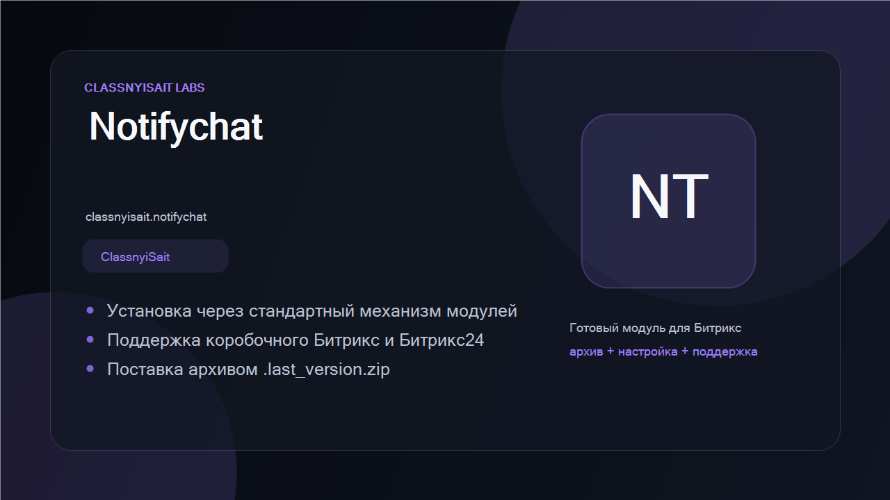
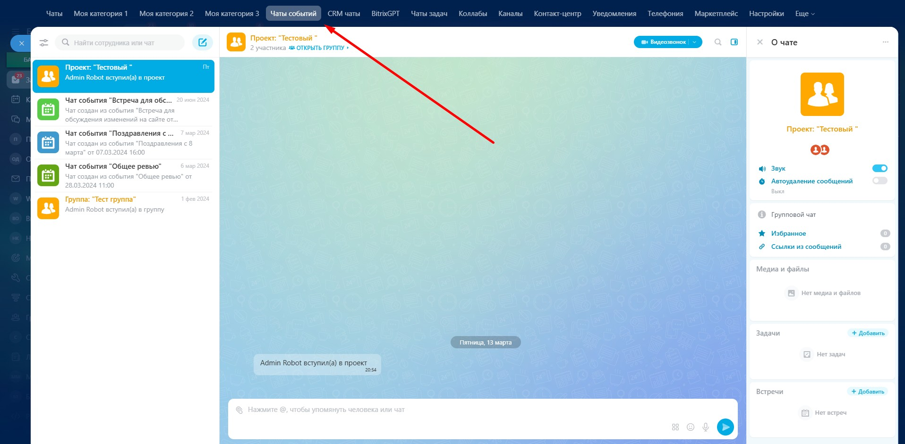

# Event Chats for Bitrix24

[Русская версия](README.ru.md) · [MIT License](LICENSE)

[](https://github.com/ClassnyiSait-Labs/bitrix24-event-chats/actions/workflows/ci.yml) [](LICENSE)


Free and open-source module for **self-hosted Bitrix24** that gives calendar-event chats their own
section in the messenger — the same way task chats already have one.



## Why

Bitrix24 creates a chat for every calendar event. Those chats land in the general Recent list and
push real conversations down. Task chats already have a dedicated section; event chats did not.
This module adds it.

## Features

- Dedicated "Event chats" section in the Recent list.
- Mirrors the behaviour of the built-in "Task chats" section.
- Purely additive — the standard messenger navigation is untouched.

## Requirements

- Self-hosted Bitrix24, version 26.0 or newer
- Web version of the messenger

## Installation

1. Copy the `classnyisait.notifychat` folder into `/local/modules/` (or `/bitrix/modules/`).
2. **Marketplace → Installed solutions** → *Event chats* → *Install*.
3. Reload the messenger — the "Event chats" section appears in the list.

Marketplace listing: <https://classnyisait.ru/modules/>

## Screenshots



## Project layout

```
classnyisait.notifychat/
├── install/js/          messenger navigation integration and event chat filter
├── lib/NotifyChat.php   event chat selection logic
├── lib/EventHandler.php, lib/EventRegistrar.php  event wiring
└── test/                PHP tests
```

## Development

```bash
composer install
composer test          # 31 PHPUnit tests
```

Tests cover the pure logic that runs without a Bitrix kernel. Anything touching the
database, the basket or the messenger UI needs a live portal and is verified manually —
see [CONTRIBUTING.md](CONTRIBUTING.md).

CI runs the linter and the test suite on PHP 8.1, 8.2 and 8.3 for every push and pull request.

## Contributing

Issues and pull requests are welcome. Please state your Bitrix24 build number when reporting a
problem with the messenger UI.

## License

MIT — see [LICENSE](LICENSE).

Developed by [ClassnyiSait Labs](https://classnyisait.ru/) ·
[Support the developer](https://classnyisait.ru/support)
